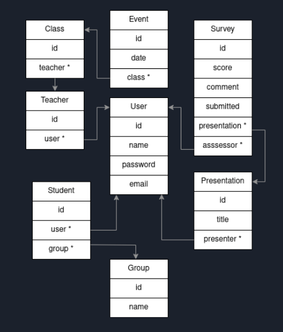
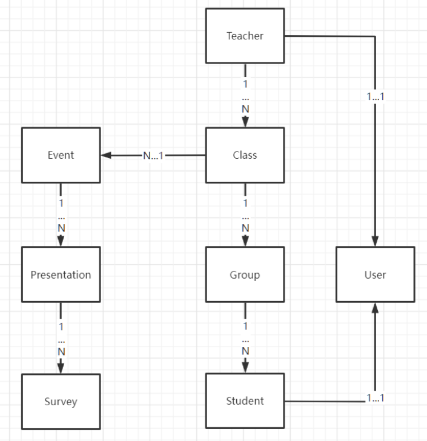

# proj6-headless

## Installation
0. `bundle install` for gems
1. [if errors] Run `rails db:environment:set RAILS_ENV=development` (possibly multiple times)
2. Run `rails db:reset`
3. Run `rails db:migrate`

## Usage

* Users, classes, events, surveys, presentations can all be created within the web app

## Avalibale Feature
- [x] Session related (with devise)
    - [x] log in
    - [x] sign up
- [x] survey related (with devise)
    - [x] see current user's comment
    - [x] see the comment under presentation and group with pos/neg + avg score
- [ ] class related (with devise)
- [ ] group related (with devise)

## User type
### Student
you are able to 
- see your survey
- make new survey to certain presentation
- view presentation result
### teacher
you are able to 
 - view all the classes

## Database structure

